<p align="center">
  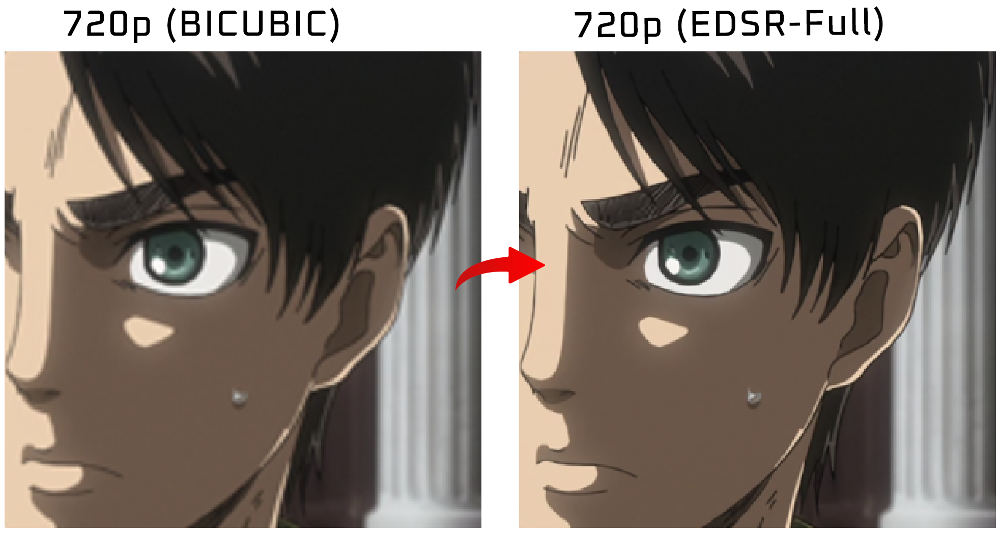
</p>

# Anime Super-Resolution με SRCNN και EDSR

<p align="center">
  
  
  
  
  
</p>

Εργασία για το μάθημα «**Βαθιά Μάθηση**» του μεταπτυχιακού προγράμματος **Τεχνητή Νοημοσύνη και Οπτική Υπολογιστική**
του **Πανεπιστήμιο Δυτικής Αττικής**. Η εργασία υλοποιεί σύστημα x2 Super Resolution εικόνας σε περιεχόμενο anime/digital art, με σύγκριση τριών μοντέλων εκπαιδευμένων από μηδέν: SRCNN, EDSR-Baseline και EDSR-Full, το καθένα με τροποποιήσεις για τις ανάγκες του συγκεκριμένου προβλήματος. Δοθέντος μιας LR (Low Resolution) εικόνας, το μοντέλο παράγει μια HR (High Resolution) εικόνα.

---

## Αποτελέσματα

| Μοντέλο | Avg PSNR (dB) ↑ | Avg SSIM ↑ | Avg LPIPS ↓ | Παράμετροι | Inference |
|---------|--------------|----------|----------|------------|-----------|
| Bicubic (baseline) |   39.17   |   0.9785   |   0.0516   |   -   |            -            |
| SRCNN              |   42.44   |   0.9875   |   0.0221   | ~57K  |         ~76 ms          |
| EDSR-Baseline      |   44.37   |   0.9903   |   0.0110   | ~1.2M |         ~79 ms          |
| EDSR-Full          | **46.46** | **0.9928** | **0.0079** | ~38.4M | ~261 ms (FP16 TensorRT, full image) |

> Όλα τα μοντέλα αξιολογήθηκαν σε 188 anime frames που δεν συμπεριλαμβάνονταν στα δεδομένα εκπαίδευσης.
> PSNR/SSIM υπολογίστηκαν στο κανάλι Y (φωτεινότητα), το LPIPS σε πλήρες RGB. Inference σε RTX 4070 Super (12 GB).  
> SSIM υπολογίζεται με sliding 11x11 Gaussian window (`skimage.metrics.structural_similarity`), το οποίο είναι το standard reference implementation.
> Για PSNR/SSIM υψηλότερη τιμή είναι καλύτερη, για LPIPS χαμηλότερη. Δείτε [Μετρικές Αξιολόγησης](#μετρικές-αξιολόγησης) για επεξήγηση.

---

## Μετρικές Αξιολόγησης

### Γιατί όχι confusion matrix / accuracy;
Η εκφώνηση αναφέρει ενδεικτικά confusion matrices και accuracy curves. Αυτές όμως είναι μετρικές **classification**. Το Super Resolution είναι πρόβλημα **regression**: το μοντέλο δεν προβλέπει κατηγορία, αλλά συνεχείς τιμές pixel για κάθε σημείο της εικόνας. Επομένως confusion matrix, accuracy, precision/recall δεν ορίζονται. Οι κατάλληλες μετρικές είναι αυτές που "ποσοτικοποιούν" **πόσο κοντά** βρίσκεται η ανακατασκευασμένη εικόνα στην πραγματική HR (ground truth). Χρησιμοποιούνται τρεις, που καλύπτουν διαφορετικό επίπεδο ομοιότητας:

### PSNR / Peak Signal-to-Noise Ratio (υψηλότερο καλύτερο)
Βασίζεται στο μέσο τετραγωνικό σφάλμα (MSE) ανάμεσα στην έξοδο και το ground truth, εκφρασμένο λογαριθμικά σε decibel: `PSNR = 10*log10(MAX^2 / MSE)` (με `MAX=1` στο εύρος [0,1]). Μετρά καθαρά την πιστότητα ανά pixel. Το μειονέκτημά του είναι ότι **δεν μοντελοποιεί την ανθρώπινη όραση**, μπορεί να δώσει υψηλή τιμή σε μια ελαφρώς θολή εικόνα (μικρό μέσο σφάλμα), άσχετα αν στο μάτι φαίνεται χειρότερη από μια πιο sharp.

### SSIM / Structural Similarity (υψηλότερο καλύτερο)
Αντί να συγκρίνει pixel-by-pixel, συγκρίνει **τοπικά παράθυρα** της εικόνας ως προς την φωτεινότητα, την αντίθεση, και την "δομή", και τις συνδυάζει. Υπολογίζεται με κυλιόμενο 11x11 Gaussian window. Εύρος [0,1], με 1 = πανομοιότυπες εικόνες. Συσχετίζεται **καλύτερα από το PSNR** με την αντιληπτή (από το μάτι) δομική (για αυτό λέγεται "Structural similarity") υποβάθμιση όπως blur, απώλεια ακμών, και για αυτό αναφέρεται μαζί με το PSNR ως συμπληρωματική μετρική και όχι ως αντικαταστάτης.

### LPIPS / Learned Perceptual Image Patch Similarity (χαμηλότερο καλύτερο)
Τόσο το PSNR όσο και το SSIM παραμένουν "απλές" μετρικές, συγκρίνουν τιμές pixel ή μικρά παράθυρα. Το LPIPS περνά και τις δύο εικόνες μέσα από ένα **προεκπαιδευμένο CNN** (εδώ AlexNet) και τις συγκρίνει με βάση το τι "βλέπει" το δίκτυο σε αυτές όπως σχήματα, μοτίβα, και υφές, όχι τις ακριβείς τιμές των pixel. Έτσι πιάνει διαφορές που το PSNR/SSIM χάνουν, κυρίως στο πόσο πιστή φαίνεται η υφή. Υπολογίζεται σε πλήρες RGB, με χαμηλότερη τιμή να σημαίνει πιο όμοιες εικόνες.

Οι τρεις μετρικές μετράνε από απλά σε σύνθετα: **pixel-level (PSNR) -> δομή (SSIM) -> ανθρώπινη ματιά (LPIPS)**. Και οι τρεις συμφωνούν στην κατάταξη των μοντέλων (το EDSR-Full είναι το καλύτερο και στις τρεις), γεγονός που επιβεβαιώνει ότι η ανωτερότητά του δεν είναι αποτέλεσμα μιας μόνο μετρικής που ευνοεί συγκεκριμένη συμπεριφορά.

---

## Μοντέλα

| Μοντέλο | Αρχιτεκτονική | Είσοδος | Σημειώσεις |
|---------|--------------|---------|------------|
| **SRCNN**         | 3-layer CNN                | Bicubic-upscaled Y-channel | Classic baseline [Dong et al., 2014](https://arxiv.org/abs/1501.00092) |
| **EDSR-Baseline** | 16 res-blocks, 64 filters  |        LR RGB patch        | EDSR Baseline [Lim et al., 2017](https://arxiv.org/abs/1707.02921) |
| **EDSR-Full**     | 32 res-blocks, 256 filters |        LR RGB patch        | EDSR Full [Lim et al., 2017](https://arxiv.org/abs/1707.02921) |

Το μοντέλο SRCNN απαιτεί η LR εικόνα να γίνει upscale μέσω bicubic σε HR, και στη συνέχεια να δουλέψει πάνω στο luminance (Y channel) των 33x33 patches. Τα μοντέλα EDSR δουλεύουν σε patches της LR RGB εικόνας απευθείας, δεν γίνεται upscaling ούτε κάποια μετατροπή color space.

<p align="center">
  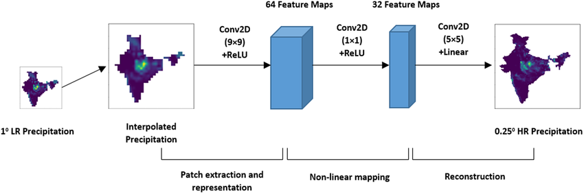<br>
  <em>SRCNN: 3-layer CNN που επεξεργάζεται το Y channel της bicubic-upscaled εικόνας.</em>
</p>

<p align="center">
  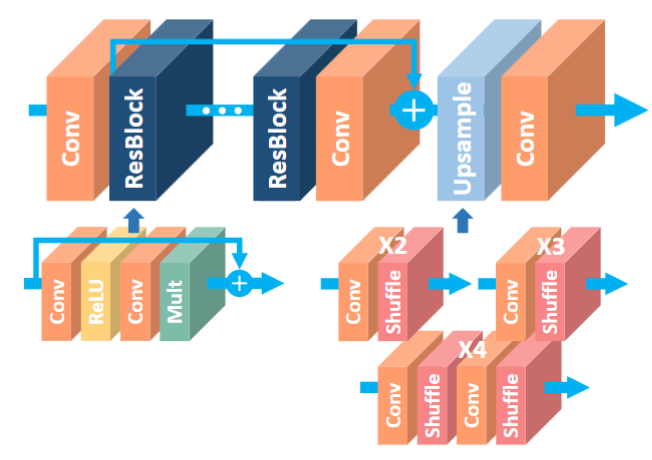<br>
  <em>EDSR: Residual blocks με global skip connection και pixel shuffle upsampling. Το διάγραμμα δείχνει τις τρεις upscale παραλλαγές του paper (x2/x3/x4), η υλοποίηση αυτή χρησιμοποιεί μόνο το x2. Το ίδιο διάγραμμα ισχύει για Baseline (16 blocks, 64 filters) και Full (32 blocks, 256 filters).</em>
</p>

---

## Μεθοδολογία και Επιλογές Σχεδιασμού

Σε όλα τα μοντέλα έχουν γίνει τροποποιήσεις όσον αφορά το κομμάτι της εκπαίδευσης, λόγω ότι το domain (ψηφιακή τέχνη) επωφελείται από διαφορετικές παραμέτρους από αυτές που ορίζονται στα αρχικά papers αλλά και λόγω περιορισμών στο hardware.

### Y Channel στο SRCNN (αντί RGB)
Δοκιμάστηκε αρχικά εκπαίδευση του SRCNN απευθείας σε RGB εικόνες, αλλά εγκαταλείφθηκε λόγω έντονων color artifacts στα αποτελέσματα: τα χρώματα εμφανίζονταν παραμορφωμένα, με ορατή απώλεια χρωματικής πληροφορίας.

Η αιτία είναι η περιορισμένη χωρητικότητα του μοντέλου (57K παράμετροι, 3 layers), το δίκτυο δεν έχει αρκετή εκφραστική ικανότητα να μάθει ταυτόχρονα sharpening του luminance αλλά και διατήρηση των χρωματικών καναλιών αμετάβλητα. Το αποτέλεσμα είναι "color drift" στα Cb/Cr κανάλια.

Η λύση είναι η μετατροπή σε **YCbCr**: το SRCNN εκπαιδεύεται και κάνει inference μόνο στο **Y κανάλι**, ενώ τα Cb/Cr (chroma channels) λαμβάνονται από την bicubic upscaled εικόνα και επανενώνονται στο τέλος. Αυτή ακριβώς είναι και η προσέγγιση του πρωτότυπου paper [Dong et al., 2014](https://arxiv.org/abs/1501.00092).

Τα EDSR μοντέλα δεν εμφανίζουν αυτό το πρόβλημα. Κάθε residual block χρησιμοποιεί **skip connections** (`output = input + F(input)`): το δίκτυο μαθαίνει το **residual** `F(input)`, δηλαδή μόνο την απαραίτητη διόρθωση πάνω στην είσοδο, όχι πλήρη ανακατασκευή από μηδέν. Αυτό κάνει την εκπαίδευση πιο σταθερή και αποτρέπει την "ολίσθηση" οποιουδήποτε καναλιού. Παράλληλα, η πολύ μεγαλύτερη χωρητικότητα (1.2 έως 38.4 εκατομμύρια παραμέτρους έναντι 57K του SRCNN) δίνει στο δίκτυο αρκετή εκφραστική ικανότητα να επεξεργαστεί σωστά και τα τρία RGB κανάλια ταυτόχρονα χωρίς artifacts.

### MAE αντί MSE στο SRCNN
Το αρχικό SRCNN paper χρησιμοποιεί MSE (L2) loss. Στην υλοποίηση αυτή επιλέχθηκε **MAE (L1) loss**, με αισθητή μείωση των ringing artifacts στα αποτελέσματα.

Θεωρητικά, η MSE "τιμωρεί" τα μεγάλα σφάλματα (τετραγωνική αύξηση), οδηγώντας το μοντέλο να προσπαθεί πολύ να ελαχιστοποιήσει τα σφάλματα κοντά σε ακμές υψηλής αντίθεσης. Αυτό προκαλεί artifacts γύρω από τις ακμές κατά την εκπαίδευση που εκδηλώνονται ως ringing. Η MAE έχει σταθερή κλίση (±1) ανεξαρτήτως μεγέθους σφάλματος, οπότε δεν δημιουργεί αυτή την υπερβολική έλξη προς τις ακμές, παράγοντας αισθητή μείωση του ringing (δεν το εξαλείφει εντελώς).

### Tiled Inference στο EDSR-Full
Κατά το inference, το EDSR-Full επεξεργάζεται μία πλήρη εικόνα 640x360. Με 32 blocks x 256 filters, τα ενδιάμεσα feature maps απαιτούν περίπου 25 GB VRAM στις δοκιμές, πολύ περισσότερο από τα διαθέσιμα 12 GB της συγκεκριμένης GPU. Η λύση είναι **tiled inference**: η εικόνα χωρίζεται σε επικαλυπτόμενα tiles 192x192 LR pixels, κάθε tile περνά από το μοντέλο ξεχωριστά, και τα αποτελέσματα συνενώνονται μέσω σταθμισμένου μέσου όρου (weighted average).

Χωρίς επικάλυψη (overlap) θα εμφανίζονταν ορατές ασυνέχειες (seams) στα όρια των tiles, γιατί τα boundary pixels βλέπουν λιγότερο context και το μοντέλο παράγει διαφορετικές τιμές από κάθε πλευρά. Η επικάλυψη των **8 LR pixels** ανά πλευρά (16 pixels στην HR έξοδο) εξαλείφει αυτά τα artifacts, το weighted average blending εξασφαλίζει ομαλή μετάβαση στις επικαλυπτόμενες περιοχές. Δοκιμάστηκε και overlap=16, με ίδιο PSNR αλλά +50% αργότερο inference, επιβεβαιώνοντας ότι overlap=8 είναι επαρκές, οπότε και εγκαταλείφθηκε. Η ίδια τεχνική (tiled inference) χρησιμοποιείται και σε production SR συστήματα όπως το Real-ESRGAN για τον ίδιο ακριβώς λόγο.

Το inference τρέχει με **mixed FP16 precision** (`mixed_float16` policy): τα weights παραμένουν FP32 αλλά οι πράξεις εκτελούνται σε FP16, τα WMMA tiles (Tensor Cores) χωράνε 2 φορές περισσότερα FP16 elements από FP32, διπλασιάζοντας το throughput ανά operation, ενώ τα activations καταλαμβάνουν μισό χώρο στη μνήμη (μειωμένο memory bandwidth). Αποτέλεσμα: 1018ms -> **562ms** (1.8x speedup περίπου) χωρίς καμία απώλεια ποιότητας (46.44 dB vs 46.44 dB FP32). Αντίστοιχα, το Real-ESRGAN χρησιμοποιεί FP16 inference by default.

Πραγματοποιήθηκε επιπλέον βελτιστοποίηση του inference στο EDSR-Full με **batch tiling**: αντί κάθε tile να περνά ξεχωριστά από το μοντέλο, περνούν ομαδοποιημένα ανά N. Κάθε ξεχωριστή κλήση του `model.predict()` έχει Python/Keras overheads και ένα blocking GPU->CPU sync.

Δοκιμάστηκαν διάφορα μεγέθη tile batch:

| batch_size | Inference (ms) | VRAM usage (RTX 4070 Super) |
|---|---|---|
| 1 (αρχικό) | 563.8     |            3.5 GB          |
| 2          | 512.1     |            6.0 GB          |
| **3**      | **502.0** |          **9.3 GB**        |
| 8          | 4565.6    | >12 GB -> overflow στη RAM |

Με batch=8 τα 24 GB activations (8 tiles x 3 GB) ξεπερνούν τα 12 GB VRAM και spill στη system RAM (shared GPU memory), με αποτέλεσμα 8x επιβράδυνση. Το **batch=3** είναι το καταλληλότερο για τη συγκεκριμένη GPU: 3 tiles x 3 GB = 9 GB, μέσα στα όρια, με **11% speedup** συνολικά (562ms -> 502ms) χωρίς καμία επίδραση στην ποιότητα (PSNR/SSIM αμετάβλητα).

### TensorRT Compilation στο EDSR-Full

<p align="center">
  
</p>

Τελευταίο βήμα βελτιστοποίησης: **TensorRT compilation** μέσω torch-tensorrt 2.11.0. Αντίθετα από το Keras `model.predict()` που εκτελεί κάθε layer ξεχωριστά με Python overhead, το TensorRT αναλύει ολόκληρο το graph και εφαρμόζει **kernel fusion**: πολλαπλά layers (conv + bias + relu + residual add) συγχωνεύονται σε λιγότερους kernels. Αυτό εξαλείφει το overhead των ενδιάμεσων GPU->memory rounds trips μεταξύ layers, μειώνοντας δραματικά την κατανάλωση VRAM από 9.3 GB (Keras batch=3) σε 2.1 GB (TensorRT batch=8 tiles).

Με το kernel fusion, το VRAM footprint μειώνεται τόσο ώστε να δοκιμαστεί το τελευταίο βήμα βελτιστοποίησης: Inferece **ολόκληρης LR εικόνας (640×360) χωρίς tiling**. Χωρίς TensorRT αυτό ήταν αδύνατο, ακόμα και το Keras FP16 με batch=3 tiles χρειαζόταν 9.3 GB, και με batch=8 (όλα τα tiles μαζί) γινόταν overflow στη RAM. Με TensorRT το kernel fusion μειώνει δραματικά τα ενδιάμεσα activations που γράφονται στη VRAM μεταξύ layers, επιτρέποντας full image inference στα 2.2 GB VRAM. Αυτό εξαλείφει εντελώς την λογική του tiling, και τα τυχόν stitching artifacts στα borders των tiles που μπορεί να παραχτούν (Με το overlap blending στα 8 pixel που θέσαμε αυτό το πρόβλημα είχε εξαλειφτεί, αλλά αυξάνει πολυπλοκότητα υπολογισμών, αφού ξανα διαβάζονται και υπολογίζοναι συνελίξεις για τα κοινά pixels στα borders). Το TensorRT engine compile γίνεται με static shape `(1, 360, 640, 3)`.

Αποτέλεσμα: **261 ms** (full image TensorRT FP16) vs 502ms (batch=3 Keras FP16), **48% speedup** συνολικά.

| Μέθοδος | Inference (ms) | VRAM | Σημειώσεις |
|---|---|---|---|
| Keras FP16 batch=3 (best case χωρίς TensorRT) |   502.0   |   9.3 GB   | 8 tiles, 3 ανά predict call (max εφικτό) |
| TensorRT FP16 batch=8 tiles                   |   367.0   |   2.1 GB   | 8 tiles σε 1 GPU call |
| **TensorRT FP16 full image**                  | **261.0** | **2.2 GB** | **1 call, χωρίς tiling** |

Το TensorRT engine κάνει compile μία φορά κατά το πρώτο τρέξιμο (142 δευτερόλεπτα για full image static shape στη δική μου περίπτωση) και αποθηκεύεται στον δίσκο ως `edsr_full_TensorRT.pt2` (102 MB). Σε κάθε επόμενο run φορτώνεται σε 0.3s. Το compiled engine είναι specific στο hardware, οπότε δεν μεταφέρεται μεταξύ διαφορετικών GPU, κάθε μηχάνημα κάνει το δικό του compile μια φορά. Αυτό είναι ακριβώς το production pattern που ακολουθούν συστήματα όπως το Triton Inference Server και το ONNX Runtime (με TensorRT Execution Provider). Αν χαθεί ή διαγραφεί το `.pt2` αρχείο, το evaluation το ξαναφτιάχνει αυτόματα.

**Περιορισμός TensorRT:** Το engine είναι compiled αποκλειστικά για 640x360 LR input, εικόνα διαφορετικής ανάλυσης δεν μπορεί να το χρησιμοποιήσει. Αυτό λειτουργεί για το συγκεκριμένο project όπου το σύνολο δεδομένων είναι πάντα 640x360 LR / 1280x720 HR. Για οποιαδήποτε ανάλυση η λύση θα ήταν TensorRT dynamic shapes (`min_shape`/`opt_shape`/`max_shape`), που μας επιστρέφει στο tiled inference με 8 x 192x192 tiles, ένα βήμα πίσω. Το fallback `_tiled_sr_predict` (χωρίς TensorRT) υπάρχει ήδη στον κώδικα και χειρίζεται οποιαδήποτε ανάλυση. Άν γνωρίζουμε πως η ανάλυση θα είναι πάντα σταθερή τότε η τελευταία υλοποίηση (TensorRT με full image) είναι αυτή που έχει γρηγορότερο inference (261 ms), αλλιώς θα εφαρμόζαμε την προηγούμενη (tiled TensorRT) στα 367 ms που είναι καλύτερη λύση από Keras χωρίς TensorRT τόσο σε απαιτήσεις VRAM όσο και σε inference time.

**Γιατί δεν εφαρμόστηκε TensorRT στα υπόλοιπα μοντέλα:** Η βελτιστοποίηση εφαρμόστηκε εκεί που υπήρχε πραγματικό bottleneck. Το EDSR-Full με 502ms ήταν ο ξεκάθαρος στόχος μας, το TensorRT με full image inference έδωσε 241ms κέρδος (48%). Για το EDSR-Baseline (~79ms) και το SRCNN (~76ms) το απόλυτο κέρδος θα ήταν μικρό, ενώ η πολυπλοκότητα αυξάνεται χωρίς λόγο. Επίσης, το EDSR-Baseline είναι memory bound (64 filters), οπότε το kernel fusion του TensorRT βοηθά κυρίως το compute κομμάτι, το bottleneck παραμένει η μεταφορά activations. Το SRCNN επεξεργάζεται την εικόνα στην πλήρη HR ανάλυση (1280x720), με αποτέλεσμα τεράστια feature maps παρά τα λίγα (57K) parameters, κάτι που κάνει τον ορισμό των TensorRT dynamic shapes πολυπλοκότερο χωρίς ουσιαστικό όφελος.

Το EDSR-Baseline παραμένει σε FP32: δοκιμάστηκε FP16 και ήταν αργότερο (102ms vs 79ms), οπότε εγκαταλείφθηκε. Για παρόμοιο λόγο δεν εφαρμόστηκε FP16 και στο SRCNN.

### Παράμετροι Εκπαίδευσης

Όλα τα μοντέλα εκπαιδεύονται με **Adam optimizer** και **MAE loss**, με τις εξής ρυθμίσεις ανά μοντέλο:

| | SRCNN | EDSR-Baseline | EDSR-Full |
|---|---|---|---|
| Learning rate   |   1e-3  | 1e-4  |  1e-4 |
| Batch size      |   64    | 32    |   8   |
| Patch size (LR) |  33x33* | 64x64 | 64x64 |
| Max epochs      |  150    | 150   |  150  |

\* Το SRCNN δέχεται ως είσοδο την LR εικόνα ήδη upscaled σε HR ανάλυση μέσω bicubic (1280x720), το 33x33 patch είναι στον HR χώρο, όχι LR. Τα EDSR δέχονται την LR απευθείας.

Χρησιμοποιούνται δύο callbacks κατά την εκπαίδευση: **EarlyStopping** (patience=20, παρακολουθεί val_loss) και **ReduceLROnPlateau** (patience=10, factor=0.5, min_lr=1e-6). Το best model αποθηκεύεται βάσει val_psnr.

Για το SRCNN δοκιμάστηκε επίσης `lr=1e-4` (ίδιο με τα EDSR) αλλά εγκαταλείφθηκε: το μοντέλο συγκλίνει πολύ πιο αργά, και το EarlyStopping (patience=20) σταματά την εκπαίδευση πριν φτάσει σε καλό σημείο, με αποτέλεσμα πτώση PSNR από ~42 dB σε ~40 dB. Το `lr=1e-3` (default στον Adam optimizer) είναι η σωστή επιλογή για ένα μικρό 3-layer μοντέλο που δεν έχει τον κίνδυνο divergence των βαθύτερων EDSR.

Χρησιμοποιείται επίσης **random flip augmentation** (οριζόντιο και κατακόρυφο) κατά την εκπαίδευση. Ενδεικτικά, η προσθήκη του στο SRCNN έδωσε **+0.40 dB** (42.04 -> 42.44 dB), επιβεβαιώνοντας ότι ακόμα και ένα απλό μοντέλο επωφελείται από augmentation.


### Residual Scaling στο EDSR-Baseline

Σύμφωνα με το επίσημο EDSR paper, το Baseline μοντέλο **δεν χρησιμοποιεί** residual scaling, αυτό εφαρμόζεται μόνο στο πλήρες EDSR (scaling=0.1). Στην υλοποίηση αυτή, το EDSR-Baseline χρησιμοποιεί scaling=0.1 και στα δύο μοντέλα.

Δοκιμάστηκε αφαίρεση του scaling από το Baseline (για πλήρη συμφωνία με το paper), αλλά εγκαταλείφθηκε λόγω των παρακάτω αποτελεσμάτων:

**Αργή σύγκλιση:** Χωρίς scaling χρειάζονταν πολλαπλάσια epochs, και με patience=20 το EarlyStopping σταματούσε την εκπαίδευση πριν φτάσει σε ικανοποιητικό σημείο.

**Memory spill στη RAM:** Χωρίς scaling παρατηρήθηκε spill στη system RAM (shared GPU memory) κατά το training, με αποτέλεσμα δραματική επιβράδυνση.

Συμπέρασμα: το scaling=0.1 στο EDSR-Baseline αποδείχθηκε ωφέλιμο για το συγκεκριμένο hardware και training setup, ακόμα και αν δεν προβλέπεται από το paper. Επιτρέπει γρηγορότερη σύγκλιση και πολύ ταχύτερο training.

### Batch size και patch size στο EDSR-Full
Το επίσημο EDSR paper χρησιμοποιεί batch=16 και patch=48x48 LR (96x96 HR). Λόγω περιορισμού VRAM (12 GB για RTX 4070 Super), επιλέχθηκε **batch=8**, η συγκεκριμένη GPU δεν χωρά 32 blocks x 256 filters με batch=16 στα 360x640. Απαιτούνταν περισσότερη μνήμη όχι μόνο από τα 12 GB της κάρτας, αλλά και από την συνολική διαθέσιμη που μπορεί να δεσμεύσει (Η GPU υποστηρίζει 28 GB max memory, όπου τα 16GB μπορεί να τα "κλέβει" από την system RAM αν ξεμείνει από την δικια της VRAM, όμως αυτό είναι καταστροφικό για την απόδοση).

Επιλέχθηκε επίσης **patch size 64x64 LR (128x128 HR)** αντί του 48x48 του paper. Για anime/digital art (μεγάλες ομοιόμορφες περιοχές, έντονες καθαρές ακμές), μεγαλύτερα patches δίνουν στο μοντέλο περισσότερο context ώστε να αναγνωρίζει και να αναπαράγει αυτές τις δομές με συνέπεια.

---

## Δομή Έργου

```
├── models.py          # Αρχιτεκτονικές μοντέλων (SRCNN, EDSR-Baseline, EDSR-Full)
├── utils.py           # PSNR, SSIM, YCbCr βοηθητικές συναρτήσεις, bicubic downscale
├── train.py           # Βρόχος εκπαίδευσης και data generators
├── evaluate.py        # Inference, μετρικές και παραγωγή γραφημάτων
├── prepare_data.py    # Καθαρισμός dataset + μετατροπή PNG -> NPY
├── downscale.py       # Bicubic x2 downscale για παραγωγή LR ζευγών
├── extract_frames.py  # Εξαγωγή frames από αρχεία βίντεο μέσω ffmpeg
└── requirements.txt
```

> **Σημείωση:** Το `best_edsr_full.keras` (~440 MB) δεν συμπεριλαμβάνεται στο repository λόγω μεγέθους. Τα `best_srcnn.keras` και `best_edsr_baseline.keras` είναι ανεβασμένα.

---

## Πλήρης Pipeline (τι έγινε)

### 1. Dataset Εκπαίδευσης
- Λήψη του [APISR Dataset](https://huggingface.co/datasets/HikariDawn/APISR_Dataset): Anime εικόνες υψηλής ποιότητας στα 1280x720, με κάποιες εικόνες σε λιγο μικρότερης ανάλυσης (καθαρίζονται στα επόμενα βήματα).
- Παραγωγή LR ζευγών (640x360) μέσω bicubic downscaling:
  ```
  python downscale.py
  ```
- Καθαρισμός dataset (αφαίρεση εικόνων που δεν είναι 1280x720 από το dataset):
  ```
  python prepare_data.py
  ```
  Εκτελεί διαδοχικά `cleanup_dataset -> precompute_edsr_data -> precompute_srcnn_data`,
  παράγοντας τα `hr_data.npy`, `lr_data.npy`, `y_hr_data.npy`, `y_lr_data.npy`.

  Τα NPY αρχεία αποθηκεύουν τις εικόνες ως raw binary arrays (uint8), επιτρέποντας φόρτωση ολόκληρου του dataset στη RAM μία φορά στην αρχή της εκπαίδευσης. Από εκεί η εξαγωγή patches είναι απλό numpy indexing, γλιτώνουμε PNG αποκωδικοποίηση ή disk I/O σε κάθε epoch. Για το SRCNN προϋπολογίζεται επίσης η bicubic μεγέθυνση και η μετατροπή YCbCr, υπολογισμός που αλλιώς θα επαναλαμβανόταν εκατοντάδες φορές κατά την εκπαίδευση.

### 2. Dataset Αξιολόγησης

Το validation set παράχθηκε από anime video sequences (διαφορετικά series από το training dataset) με εξαγωγή frames ανά 1 λεπτό μέσω `extract_frames.py` (ffmpeg, `INTERVAL_SECONDS=60`, `TARGET_HEIGHT=720`, `SCALER=lanczos`), ακολουθούμενη από τα ίδια βήματα downscale και καθαρισμού. Τελικό αποτέλεσμα: **188 HR/LR ζεύγη** στα 1280x720 / 640x360.

> Το validation dataset δεν συμπεριλαμβάνεται στο repository. Για να τρέξει το inference (`evaluate.py`), αρκεί να υπάρχουν οποιεσδήποτε HR εικόνες PNG (1280x720) στον φάκελο `datasets/validation_Dataset/`.

### 3. Εκπαίδευση
- Ορισμός `MODEL_TYPE` στο `train.py` (`"SRCNN"` ή `"EDSR"` ή `"EDSR_FULL"`), και έπειτα:
  ```
  python train.py
  ```
  Τα μοντέλα αποθηκεύονται ως `best_srcnn.keras`, `best_edsr_baseline.keras`, `best_edsr_full.keras`.

  Το dataset χωρίζεται 90/10 σε train/validation (seed `2918`): 3147 εικόνες εκπαίδευσης και 350 για validation περίπου.

### 4. Αξιολόγηση
  ```
  python evaluate.py
  ```
  Εκτελεί inference σε όλες τις 188 εικόνες αξιολόγησης και για τα τρία μοντέλα, παράγει PSNR/SSIM ανά εικόνα, λεπτομερή crop plots (20 δείγματα) και συγκριτικά γραφήματα στον φάκελο `report_figures/`.

---

## Περιβάλλον Ανάπτυξης

- Python 3.13
- Keras 3.14 με PyTorch backend (`KERAS_BACKEND=torch`)
- PyTorch 2.11.0+cu128 / CUDA 12.8
- Torch-TensorRT 2.11.0 / TensorRT 10.15.1
- Δοκιμάστηκε σε Windows 11, RTX 4070 Super 12 GB

---

## Αποτελέσματα / Σύγκριση crops (sample)

Κάθε εικόνα περιέχει (αριστερά προς δεξιά): πρωτότυπο HR crop, bicubic upscaled crop, AI SR crop, error map (θερμικός χάρτης σφάλματος έναντι HR). Sample: `my_anime_0080.png` από το validation set.

### SRCNN

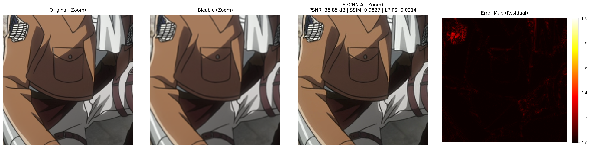

### EDSR-Baseline

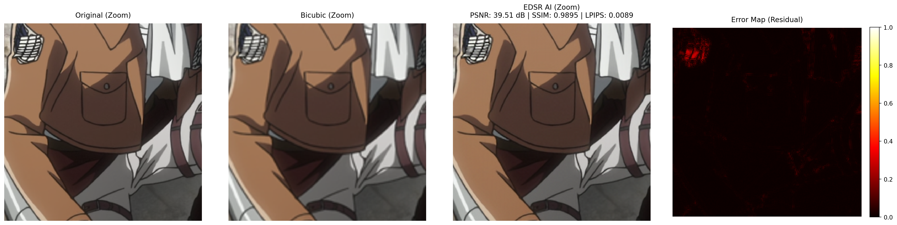

### EDSR-Full

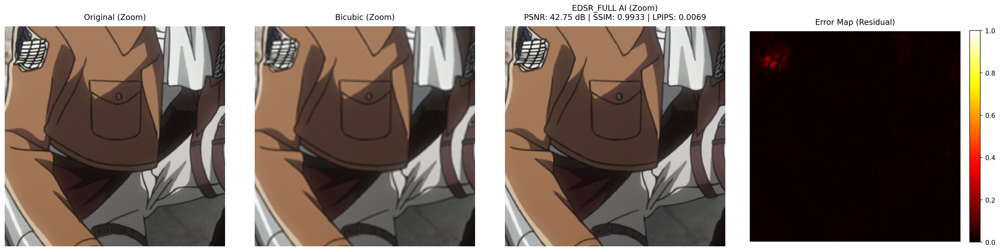

> **Πλήρη αποτελέσματα:** Οι φάκελοι `validation_results_SRCNN/`, `validation_results_EDSR/` και `validation_results_EDSR_FULL/` περιέχουν για κάθε μοντέλο:
> - `results.json`: PSNR/SSIM για κάθε εικόνα του validation set
> - `detailed_report.txt`: μέσοι όροι μετρικών
> - `detailed_*.png`: crop comparisons για τις πρώτες 20 εικόνες

---

## Αποτελέσματα / Γραφήματα

### Καμπύλες Εκπαίδευσης

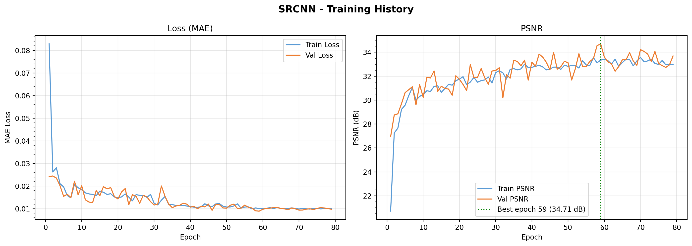

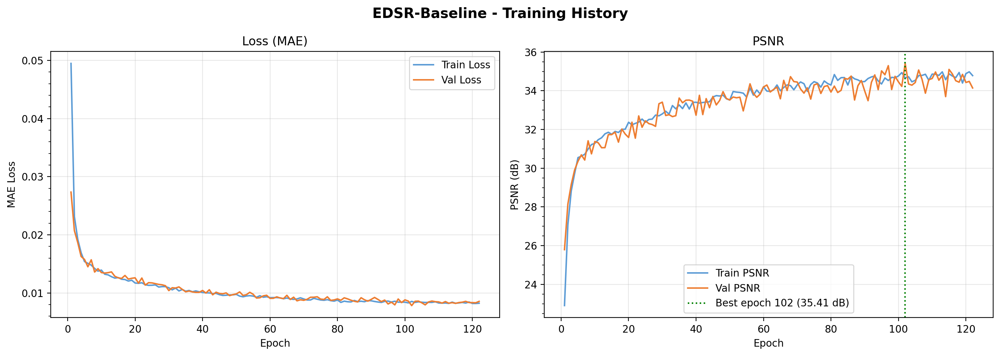

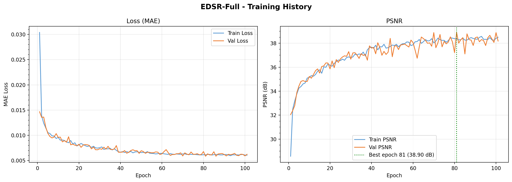

### Σύγκριση Καμπυλών Εκπαίδευσης (Validation)

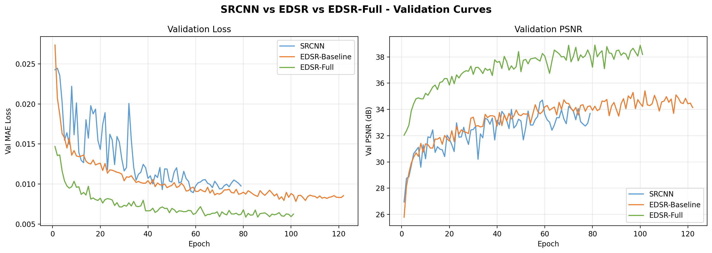

### PSNR ανά Εικόνα: Σύγκριση Όλων των Μοντέλων

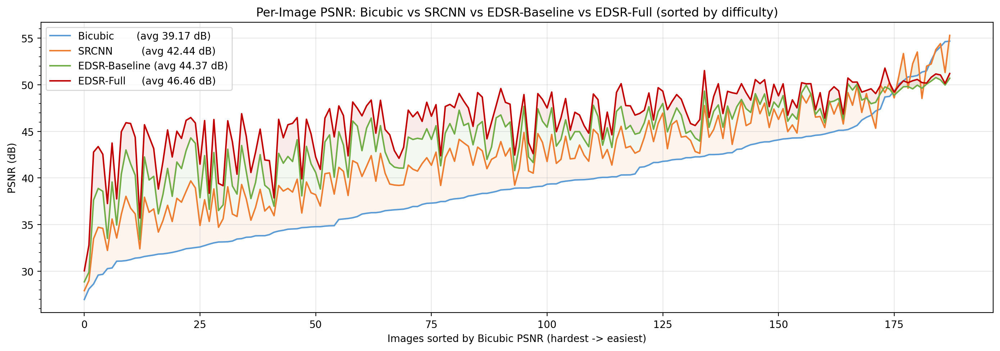

### Πίνακας Σύγκρισης

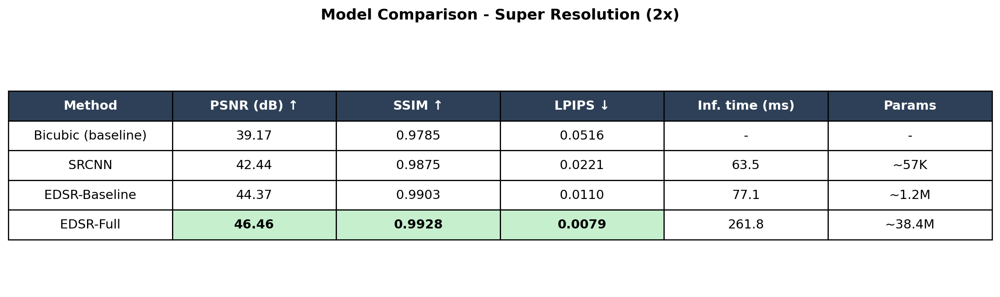

---

## Αποτελέσματα ανά Μετρική (188 εικόνες)

### PSNR ανά Εικόνα (ταξινόμηση από δύσκολη προς εύκολη)

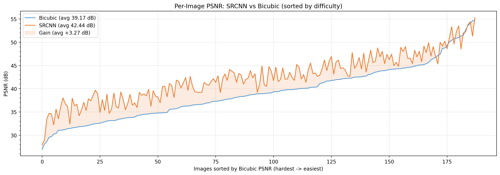

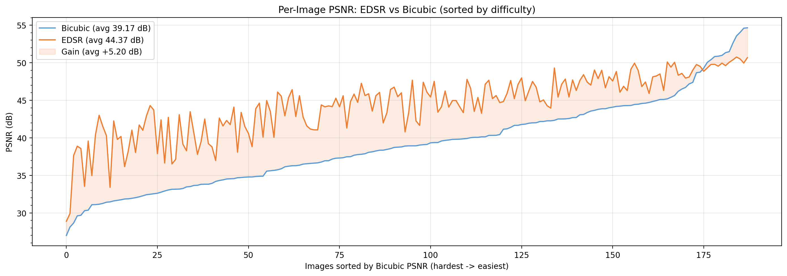

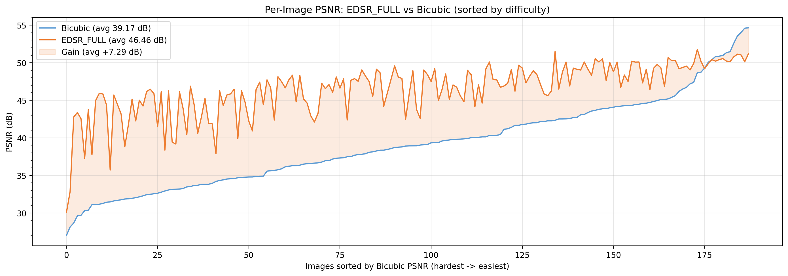

### PSNR Gain έναντι Bicubic (κατανομή)

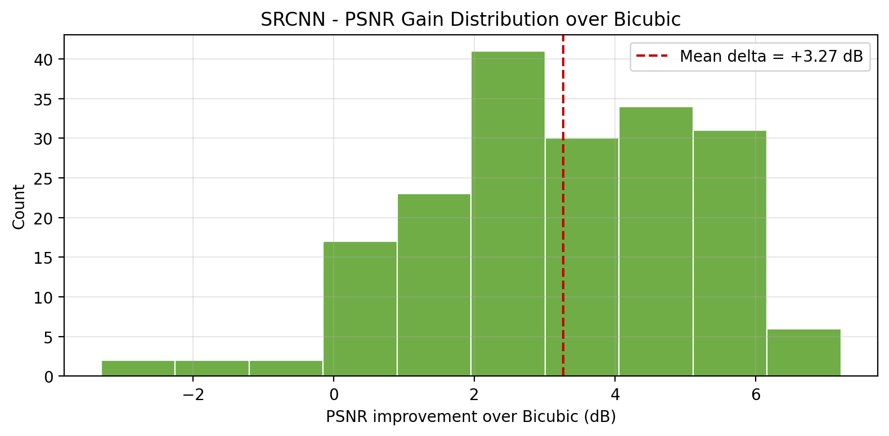

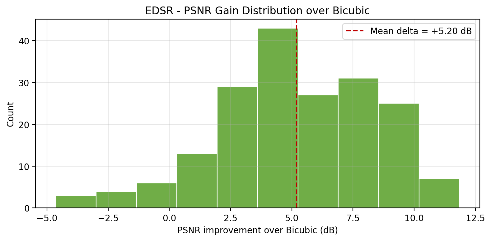

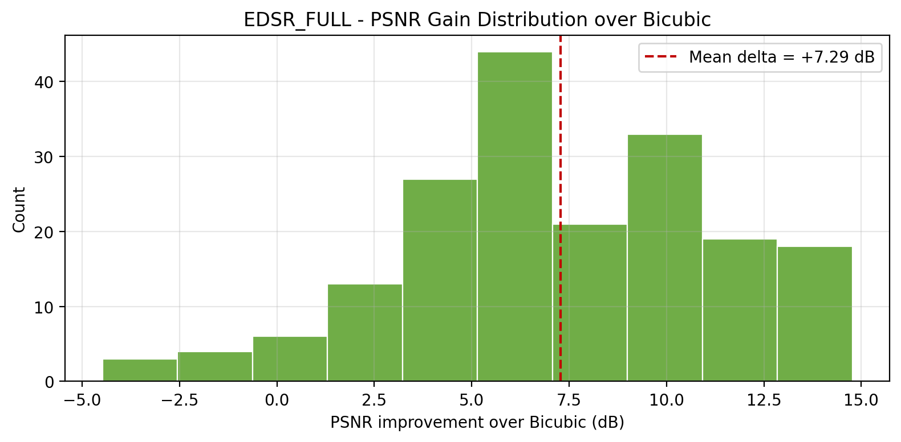

### SSIM: Μοντέλο vs Bicubic (scatter ανά εικόνα)

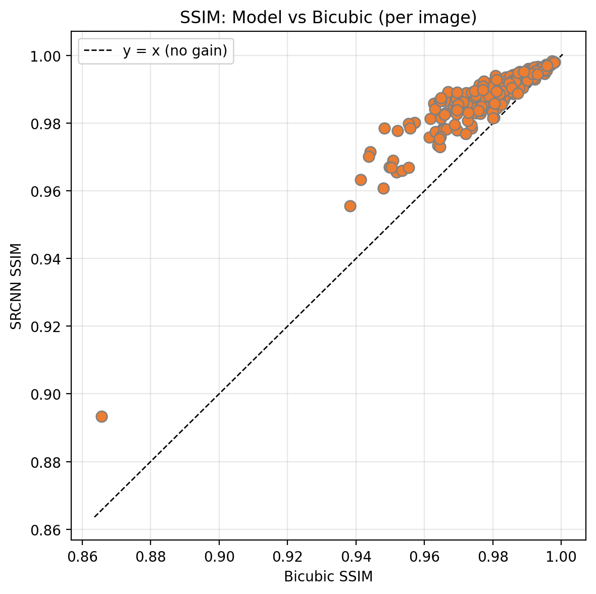

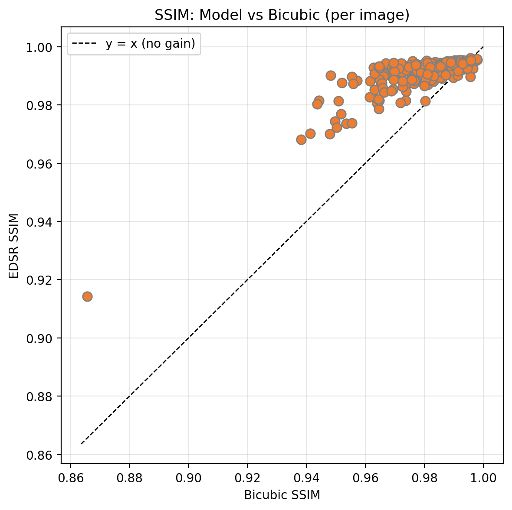

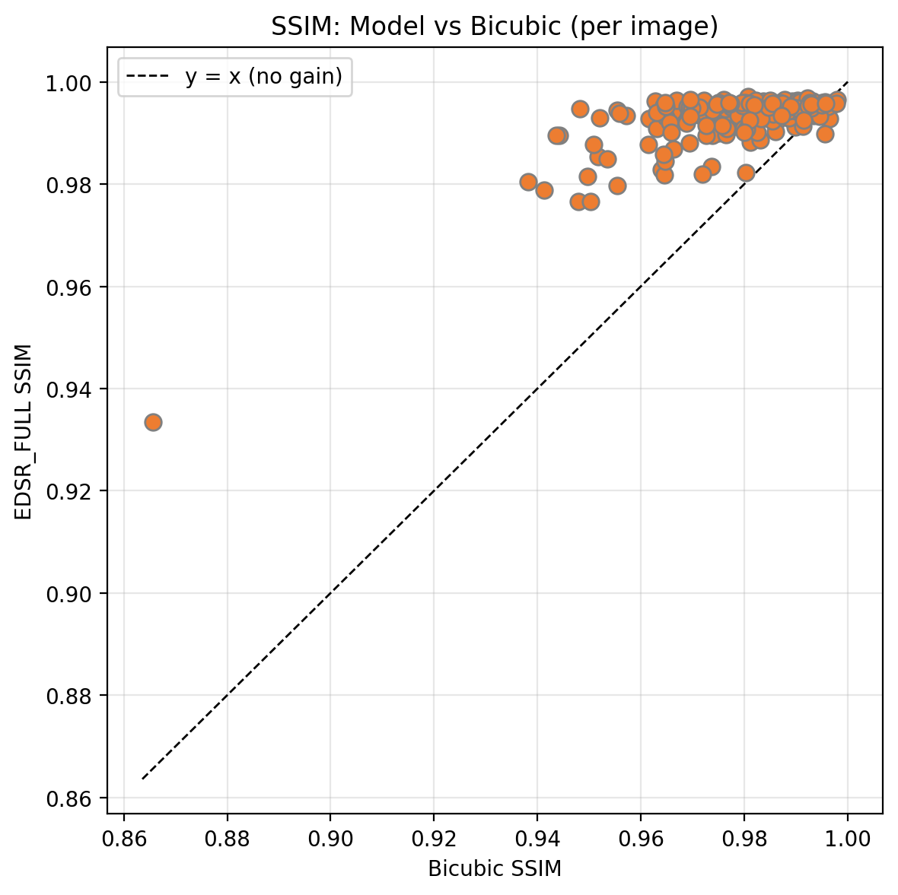

### Παρατήρηση: EDSR κάτω από bicubic σε εύκολες εικόνες

Παρατηρήθηκε οτι σε 13 από τις 188 εικόνες (7%) τα EDSR μοντέλα υστερούν έναντι του bicubic, ενώ το SRCNN όχι. Πρόκειται για σκοτεινές σκηνές, flat backgrounds και θολές εικόνες, περιεχόμενο με ελάχιστο high frequency content. Το bicubic σε τέτοιες εικόνες δεν "χαλάει" τίποτα (δεν υπάρχει detail να χαθεί), ενώ το EDSR είναι εκπαιδευμένο να προσθέτει sharpening/texture και το κάνει ακόμα και εδώ, παράγοντας detail που δεν υπάρχει στο ground truth. Το SRCNN δεν εμφανίζει το ίδιο πρόβλημα γιατί ξεκινά από την ήδη upscaled bicubic εικόνα και κάνει μικρές διορθώσεις, αντί να ανακατασκευάζει από την αρχή. Στην πράξη η επίπτωση είναι μικρή: οι εικόνες αυτές είναι ήδη θολές ή σκοτεινές, άρα δεν υπάρχει detail που να "χαλάει", η διαφορά δεν είναι ορατή στο μάτι. Στις εικόνες με πραγματικό περιεχόμενο (χαρακτήρες, κείμενο, ακμές) όπου υπάρχει detail να ανακατασκευαστεί, το EDSR-Full κερδίζει κατά μέσο όρο +7.3 dB έναντι bicubic.

---

## Σύγκριση Μοντέλων

**SRCNN**: Το απλούστερο baseline μοντέλο (57K παράμετροι) με 3-layer αρχιτεκτονική που επεξεργάζεται μόνο το Y-channel μετά από bicubic upscaling. Λόγω της περιορισμένης εκφραστικής ικανότητας δεν μπορεί να ανακατασκευάσει λεπτές λεπτομέρειες, και τα αποτελέσματα, ενώ σαφώς καλύτερα από bicubic (+3.27 dB), δεν συναγωνίζονται τα EDSR μοντέλα. Πλεονεκτήματα: ελάχιστος χρόνος εκπαίδευσης (λεπτά) και το γρηγορότερο inference. Κατάλληλο ως baseline ή για περιβάλλοντα χαμηλής υπολογιστικής ισχύος.

**EDSR-Baseline**: Καλή ισορροπία μεταξύ ποιότητας, χρόνου εκπαίδευσης και inference. Με 1.2M παραμέτρους και 16 residual blocks δίνει +5.20 dB έναντι bicubic σε FP32 (χωρίς TensorRT ή FP16). Ο χρόνος εκπαίδευσης είναι πολύ μικρότερος από το EDSR-Full και δεν υπάρχει overhead στο inference. Στις εικόνες φαίνεται ελαφρά κατώτερο από το EDSR-Full σε λεπτομέρειες υψηλής πολυπλοκότητας, αλλά σταθερά ανώτερο από SRCNN.

**EDSR-Full**: Το μοντέλο υψηλότερης ποιότητας τόσο στις μαθηματικές μετρικές (46.46 dB, +7.29 dB έναντι bicubic), όσο και πρακτικά ("στο μάτι"), η ποιότητα είναι πολύ κοντά στην αρχική HR εικόνα. Έχει όμως κάποια πρακτικά μειονεκτήματα. Ο χρόνος εκπαίδευσης είναι πολλαπλάσιος από τα υπόλοιπα μοντέλα λόγω του μεγέθους (38.4M παράμετροι). Το inference χωρίς βελτιστοποίηση είναι πολύ αργό (~1000ms ανά εικόνα), και ακόμα και με FP16 TensorRT full image inference (261ms) παραμένει 3.3x αργότερο από το EDSR-Baseline. Το TensorRT compilation απαιτεί 142 δευτερόλεπτα (στο δικό μου μηχάνημα) μια φορά σε κάθε νέο μηχάνημα και το compiled engine είναι hardware-specific. Συνιστάται όταν το μοντέλο θα εφαρμοστεί σε production με πολλούς χρήστες, π.χ web service με χιλιάδες requests: τότε τόσο ο χρόνος inference όσο και η κατανάλωση VRAM επηρεάζουν άμεσα το κόστος του server και τον αριθμό παράλληλων requests που μπορεί να εξυπηρετηθούν. Η βελτιστοποίηση με TensorRT εκεί (261ms, 2.2 GB VRAM) είναι "μονόδρομος".
